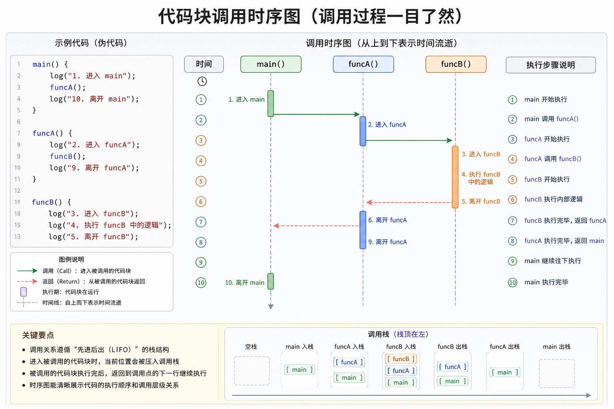

---

title: "Java 代码块、类加载与初始化时序"
publishDate: 2026-09-08
description: "从静态代码块、普通代码块出发，理解 Java 类加载、实例初始化以及继承关系中的执行时序。"
tags: [Java, 面向对象, JVM, 类加载]
----------------------------

代码块分为静态和非静态。

如果为静态，则随类的加载而执行，且只执行一次，多次创建对象不会重复执行。

而非静态代码块在创建对象时执行，且可以多次执行。

当调用构造器时，非静态代码块里的内容会在构造器里的代码调用前执行，且每一个重载的构造都依然执行非静态代码块。

```java
public class CodeBlock01 {
    public static void main(String[] args) {

        Movie movie = new Movie("a");
        System.out.println(Movie.id);
        Movie.Exhibition(); // 从运行结果可以看到，代码块只执行了一次
    }
}

class Movie {
    private String name;
    private String director;
    private int price;

    public static int id = 0;

    static {
        System.out.println("代码块被调用了");
    }

    public Movie(String name) {
        this.name = name;
    }

    public Movie(String name, String director) {
        this.name = name;
        this.director = director;
    }

    public Movie(String name, String director, int price) {
        this.name = name;
        this.director = director;
        this.price = price;
    }

    public static void Exhibition() {
        System.out.println("电影开始！");
    }
}
```

那么，问题来了，什么时候类加载呢，类加载时发生了什么，时序又是怎么样的喵？

类加载常见的触发场景包括：

* 当对象实例化时
* 当作为父类，其子类对象实例化时
* 当调用类的静态成员时（属性、方法）
* 反射
* 启动类（`main` 所在类）

接着来看看时序。

创建一个对象时，在一个类里：

1. 调用静态代码块和静态属性初始化
   注：静态代码块和静态属性初始化调用的优先级一样。如果有多个静态代码块和多个静态变量初始化，则按照其定义的顺序调用。

2. 调用普通代码块和普通属性初始化
   注：普通代码块和普通属性初始化调用的优先级一样。如果有多个普通代码块和多个普通变量初始化，则按照其定义的顺序调用。

3. 调用构造方法

```java
public class CodeBlock02 {
    public static void main(String[] args) {
        A a = new A();
    }
}

class A {

    public static int n1 = getN1(); // step 1，调用 getN1()
    public int n2 = getN2();        // step 3，调用 getN2()

    static {
        System.out.println("A 静态代码块"); // step 2
    }

    {
        System.out.println("A 普通代码块"); // step 4
    }

    public A() {
        System.out.println("构造器"); // step 5
    }

    public static int getN1() {
        System.out.println("A getN1"); // step 1
        return 10;
    }

    public int getN2() {
        System.out.println("A getN2"); // step 3
        return 10;
    }
}
```

输出结果：

```text
A getN1
A 静态代码块
A getN2
A 普通代码块
构造器
```

**什么？你问为什么是这样？**

因为构造器的最前面其实隐含了 `super()`。

而普通代码块和成员变量初始化属于“实例初始化阶段”，在构造器执行前自动完成，所以在执行构造器前，普通代码块被执行。

而静态成员在类加载时就已经执行，因此要早于普通代码块和构造器。

这时候，聪明的你一定注意到了 **`super()`**。

也就是说，在子类实例化时，父类被加载，接下来顺序为：

> 父类静态 → 子类静态 → 父类普通代码块与构造器 → 子类普通代码块和构造器

```java
public class CodeBlock03 {
    public static void main(String[] args) {
        BBB b = new BBB();
    }
}

class AAA {

    static {
        System.out.println("AAA 静态代码块"); // STEP 1
    }

    {
        System.out.println("AAA 非静态代码块"); // STEP 3
    }

    public AAA() {
        System.out.println("AAA 构造器"); // STEP 4
    }
}

class BBB extends AAA {

    static {
        System.out.println("BBB 静态代码块"); // STEP 2
    }

    {
        System.out.println("BBB 非静态代码块"); // STEP 5
    }

    public BBB() {
        System.out.println("BBB 构造器"); // STEP 6
    }
}
```

输出结果：

```text
AAA 静态代码块
BBB 静态代码块
AAA 非静态代码块
AAA 构造器
BBB 非静态代码块
BBB 构造器
```

最后，记得：

> 静态代码块只能调用静态成员，普通代码块可以调用任意成员哦～


